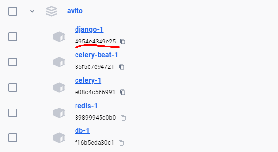
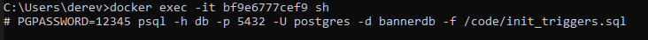
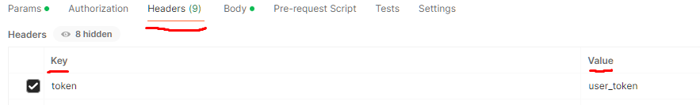

# Avito backend task

## Запуск:
Важно выполнить два последних пункта для версионности баннеров и работы всего функционала!
    1. Клонирование репозитория
    ```git clone https://github.com/LegendGaming0305/avito-backend-task.git```
    2. Билд docker-compose
    ```docker-compose build```
    3. Поднятие контейнера (может выдать ошибку на первом запуске, тогда остановить и заново запустить docker-compose up), но лучше все равно перезапустить после первого запуска
    ```docker-compose up```
    4. В командной строке/терминале вводим 
    ```docker exec -it {id docker container with django} sh```
    
    5. Далее пишем 
    ```PGPASSWORD=12345 psql -h db -p 5432 -U postgres -d bannerdb -f /code/init_triggers.sql``
    

## Описание функций и взаимодействия с API:
    - Базовый маршрут http://http://0.0.0.0:8000/api/v1/
    - Запрос пользовательского баннера user_banner/ (в headers указать key=token value='user_token/admin_token') Method GET

    в параметрах нужно указывать tag_id и feature_id, use_last_revision - по желанию

    - Баннеры для админа хранятся в /banner/ Methods GET, POST
    - Взаимодействие с определенным баннером по id находится в /banner/{id}/ GET, PATCH, DELETE
    в методе GET можно получить активный баннер и три его предыдущие версии
    - Взаимодействие с определенной версией баннера в /banner/{id}/{uuid}/ Methods GET, PATCH
    параметры в PATCH идентичны входящим параметрам в /banner/{id}/ по спецификации API

## Проблемы и решения:
    1) Первая проблема была связана с оптимизацией получения баннера. Нашел два решения этой задачи
        Решение:
            - Первый метод связан с materialized view выбора таблицы содержащей баннеры и обновления данной таблицы каждые 5 минут,
            но возникли трудности с этим. Так как Django orm не хотел дружить сам по себе с materialized view
            - Второй метод реализован через redis кэш с обновлением каждые 5 минут. Обновляем каждые 5 минут за счет Celery фоновых задач.
            Создается отдельный ключ для каждого баннера, а не всей таблицы banners. Так как нагрузка при проверке циклом for на равенство feature_id и tag_id
            увеличило бы время отклика.
    2) Версионность баннеров.
        Решение:
            - Решил эту задачу через создание триггера на уровне самой бд (хранится в файле init_triggers.sql). То есть до апдейта записи
            вставляется новая строка с новыми данными и ссылкой на предыдущую версию (которая должна подвергнуться апдейту), но старая запись не изменяется вообще.
            Чтобы иметь разные версии одного баннера сделал primary key - поле uuid с авто генерацией этого значения и добавил поле pervious_version_uuid для ссылки.
            Таким образом id баннера может повторяться, что нам и нужно, но у каждой версии будет свой uuid, что гарантирует уникальность записи.

## Нерешенные задачи:
    1) Не успел дописать тесты для всех функций, только для получения user_banner сделаны через pytest
    2) Не сделано удаления баннера по фиче и тегу

## Как можно было бы улучшить решение:
    1) Как вариант использовать не Django, потому что он не дает подружить materialized view с самим собой
    2) Есть части с повторяющимся кодом, их лучше переписать отдельно и использовать через вызов функции или метод класса.
    3) Оптимизировать запросы к бд, я не использовал индексы и это может прибавить к производительности.
    4) Возможно репиликация базы данных для read-only записей